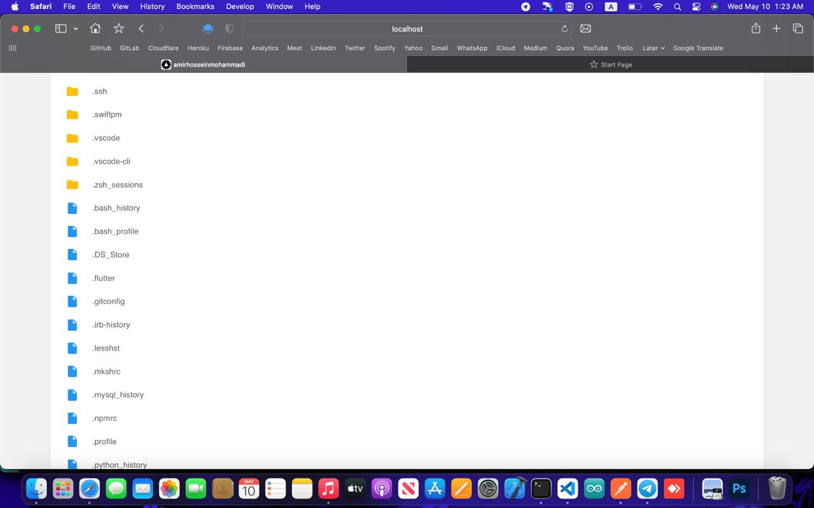
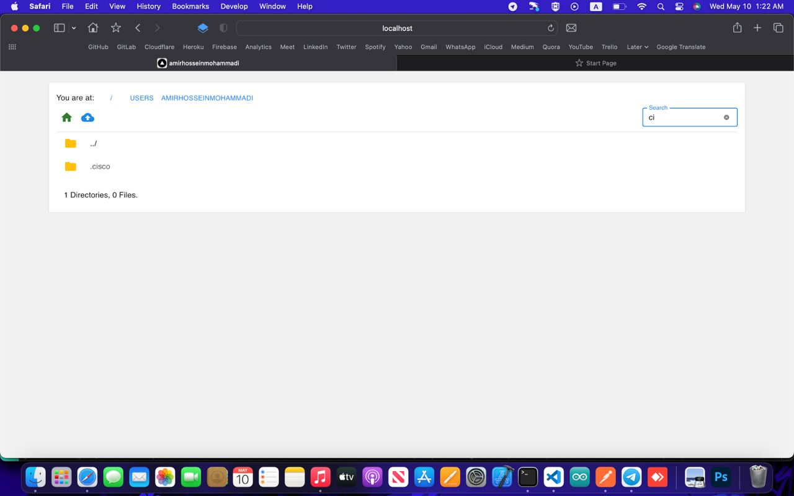
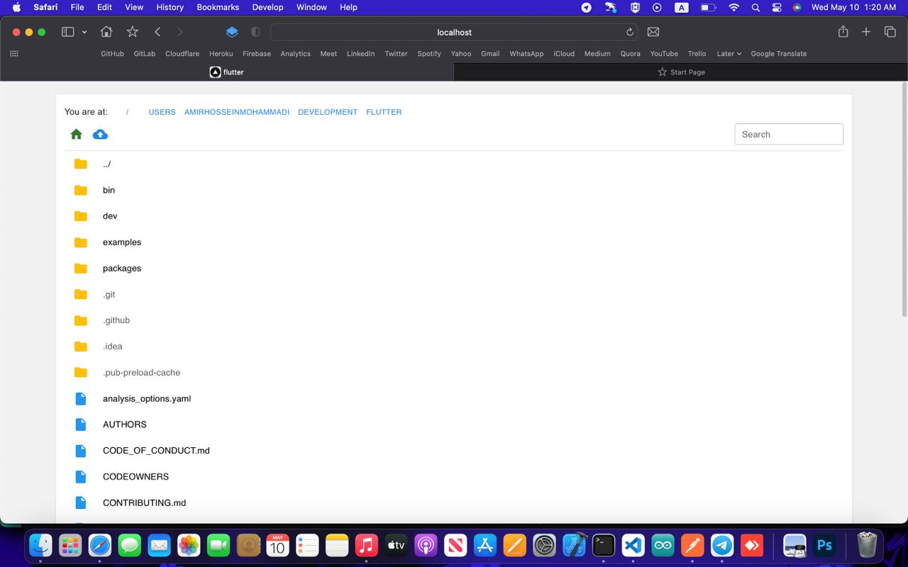
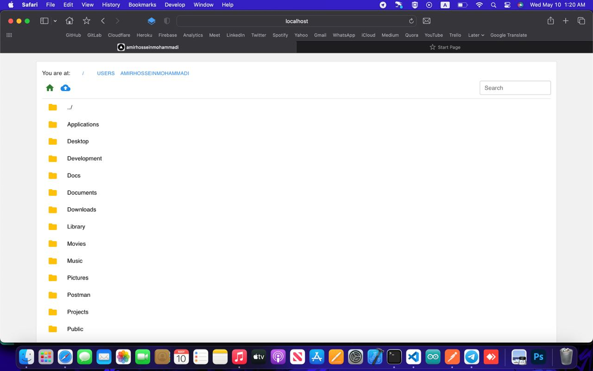

# File Manager Client

The **File Manager** project application.

Filemanager is an application you can install on your server to manage files in web. You can upload, delete, navigate and many other features. This is the client side of the project. The server side is https://github.com/BlackIQ/filemanager-api.

## Tech

- NextJs
- Material UI

## Overview

